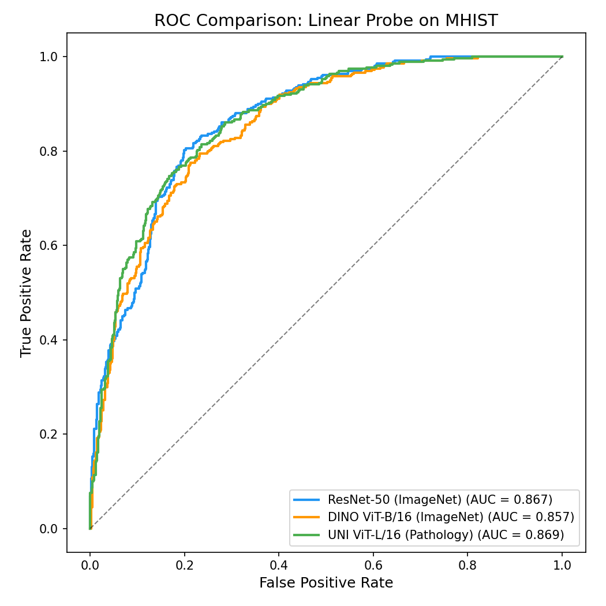
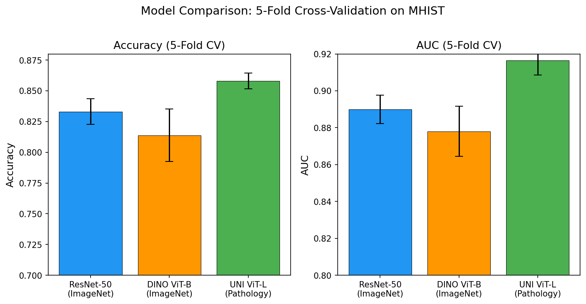

# Pathology Foundation Model Benchmark

Benchmarking pretrained foundation model representations for histopathology
image classification on the MHIST dataset. This project serves as a
preliminary benchmark for a larger research effort on multimodal
geometric-conditioned PRAME analysis for melanoma profiling.

## Models Compared
- **ResNet-50** (ImageNet supervised) — CNN baseline
- **DINO ViT-Base** (ImageNet self-supervised) — isolates architecture and training method contribution
- **UNI** (Chen et al., 2024) — pathology-specific foundation model (ViT-Large, DINOv2, 100M+ patches)

## Dataset
[MHIST](https://bmirds.github.io/MHIST/) — 3,152 histopathology images
(224×224) for binary classification of colorectal polyps (HP vs. SSA).

## Method
Feature extraction with frozen pretrained encoders → linear probe
(logistic regression) → ROC/AUC comparison.

The linear probe approach isolates the quality of learned representations:
all models are evaluated with the same classifier, so performance
differences reflect the features, not the downstream architecture.

## Experimental Design
| Model | Architecture | Pretraining Data | Training Method |
|-------|-------------|-----------------|-----------------|
| ResNet-50 | CNN | ImageNet | Supervised |
| DINO ViT-Base | ViT-B/16 | ImageNet | Self-supervised (DINO) |
| UNI | ViT-L/16 | 100M+ histopathology patches | Self-supervised (DINOv2) |

Comparing ResNet-50 → DINO isolates the effect of architecture and
training method. Comparing DINO → UNI isolates the effect of
pathology-specific training data.

## Setup
```bash
conda create -n pathbench python=3.11 -y
conda activate pathbench
pip install torch torchvision --index-url https://download.pytorch.org/whl/cpu
pip install scikit-learn matplotlib pandas pillow tqdm huggingface_hub timm
```

UNI requires a Hugging Face access token and license agreement at
https://huggingface.co/MahmoodLab/uni.

## Usage
```bash
# Extract features
python extract_features.py --model resnet50
python extract_features_dino.py
python extract_features_uni.py

# Train and evaluate linear probes
python train_probe.py --model resnet50
python train_probe.py --model dino_vitb16
python train_probe.py --model uni
```

## Results

### 5-Fold Stratified Cross-Validation on MHIST Training Set

| Model | Accuracy | AUC |
|-------|----------|-----|
| ResNet-50 (ImageNet supervised) | 0.833 ± 0.010 | 0.890 ± 0.008 |
| DINO ViT-B/16 (ImageNet self-supervised) | 0.814 ± 0.021 | 0.878 ± 0.014 |
| UNI ViT-L/16 (Pathology self-supervised) | **0.858 ± 0.006** | **0.917 ± 0.008** |

### Key Findings

1. **Pathology-specific pretraining matters.** UNI outperforms both ImageNet
   models, with a 2.7-point AUC advantage over ResNet-50 (0.917 vs 0.890).

2. **Representation stability.** UNI features produce the most consistent
   results across folds (lowest standard deviation), suggesting more robust
   learned representations.

3. **Architecture alone is insufficient.** DINO ViT-Base, sharing UNI's
   architecture family and self-supervised method but trained on ImageNet,
   performed worst — isolating pathology training data as the key factor.


